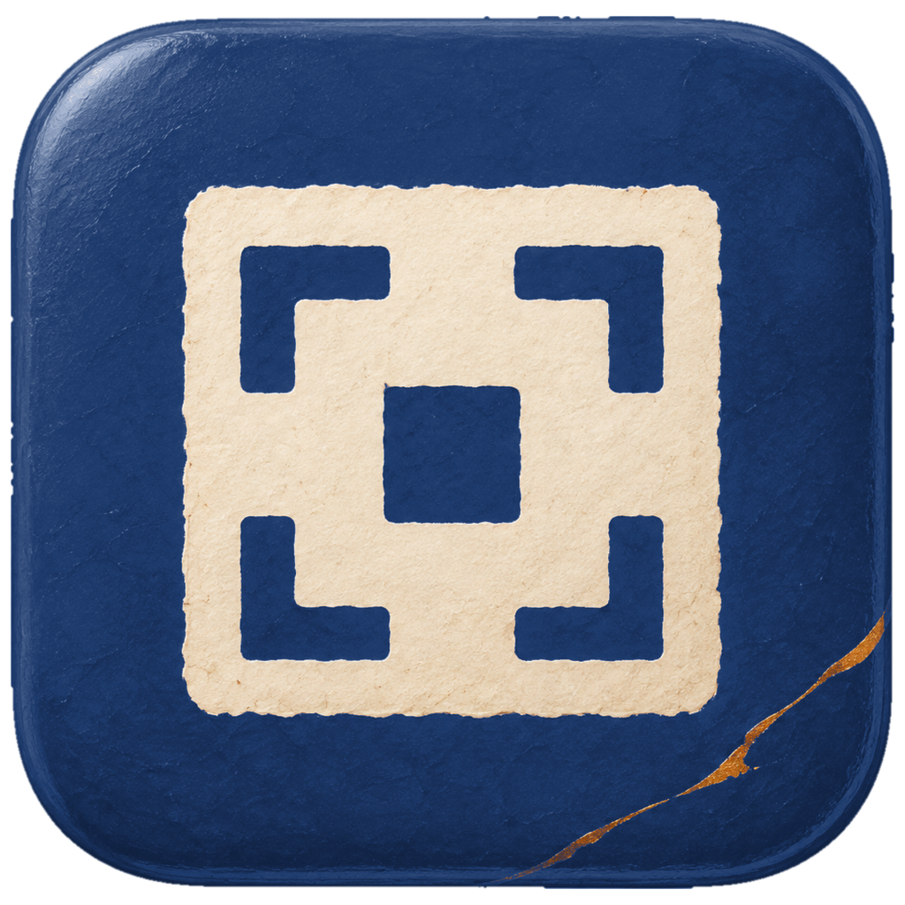

<p align="center">
  
</p>

# UTSUSHIE

UTSUSHIE(写絵)は、画面をWebP画像またはMP4動画にして、すぐ貼り付け・ドラッグで共有できるmacOSのメニューバーアプリです。

## インストール

```sh
brew install --cask tadashi-aikawa/tap/utsushie
```

UTSUSHIEは自己署名の未公証アプリです。初回起動がブロックされた場合は、システム設定 → プライバシーとセキュリティ →「このまま開く」で許可してください。

## 権限

- **画面収録**: 最初の撮影で案内が出ます。許可したらUTSUSHIEを再起動してください
- **アクセシビリティ**: Chromeのページ表示領域を撮るとき(C)だけ必要です

## 使い方

ホットキー(既定は⌘⇧2)を押すと、画面が少し暗くなって範囲を選べる状態になります。

カーソルの下のウィンドウが強調されます。

| 操作 | 動作 |
| --- | --- |
| クリック | カーソルの下のウィンドウを撮る |
| ドラッグ | 選んだ範囲を撮る |
| Enter / ホットキーをもう一度 | 前回と同じ範囲を撮る |
| ⌥を押しながら前回範囲の枠をドラッグ | 前回範囲を動かす |
| C | Chromeで表示中のページ部分だけを撮る |
| Tab | 画像と動画を切り替える |
| Esc | やめる |

- ドラッグを始めると、ウィンドウの強調から範囲選択へ切り替わります。
- ウィンドウのない場所をクリックしても、選択画面は開いたままです。
- 前回範囲の枠の中でも、クリックでその下のウィンドウを撮れます。

### 動画

Tabで動画に切り替えてから対象を選ぶと、録画が始まります。

止めるときはホットキーをもう一度押すか、メニューバーの「■ 時間」の札をクリックします。

- 範囲は1つのディスプレイの中で選んでください
- 音は録りません

## 保存と共有

撮った画像・動画は`~/Pictures/UTSUSHIE/`に保存され、同時にクリップボードへ載ります。そのまま⌘Vで貼り付けられます。

画面右下に出るカードからは、ファイルをドラッグして渡せます。

- カードが画面の高さを超える場合、左の列へ折り返します。
- 注釈・動画の編集画面が開いている間は、すべてのカードの表示時間を止めます。
    - 終了後: 残っているカードの表示時間を最初から数え直します。
    - ホバー中・書き出し中: 編集画面を閉じても、そのカードの表示時間は止まったままです。

撮影直後から、最新のカードで次のキーが使えます。

- カーソルを乗せる必要はありません。
- 別のカードへカーソルを乗せると、そのカードへキー入力が切り替わります。
    - カーソルが離れた後: そのカードが引き続きキーを受けます。
- 別のアプリをクリックすると、カードはキー入力を手放します。

| キー | 動作 |
| --- | --- |
| E | 画像に注釈を入れる・動画を切る・録画から静止画を選ぶ |
| S | 別の場所にも保存する |
| O | Finderで表示する |
| X / Esc | カードを閉じる |

画像は見た目の大きさ(1x)のWebPで保存します。

### 撮影の一覧から探して編集する

メニューバーの「撮影の一覧を開く」から、保存フォルダの画像・動画を探せます。

- 更新日時が新しい順に、日付ごとのグリッドで全件を表示します。
    - 対象: 保存フォルダ直下のWebPとMP4です。隠しファイルと一時ファイルは表示しません。
    - 表示: 絵の下に時刻・寸法・容量を表示します。動画には長さの札が付きます。
- 窓の位置と大きさを覚えます。開いた直後は最新の1件を選びます。
- 一覧から直接編集できます。完了・破棄の後は一覧へ戻ります。
    - 完了後: 絵・寸法・容量とクリップボードを更新します。
    - カード: 新しいカードは出しません。表示中のカードがあれば、その編集状態を使います。
    - 静止画: 動画から選んだ画像も一覧へ加え、クリップボードには画像を載せます。
    - 書き出し中・失敗: その項目に状態を表示します。失敗は下端にも表示します。
- 同じ起動中の最近10件では、画像の注釈を動かして再編集できます。
    - 履歴: 取り消し・やり直しも引き継ぎます。
    - 再起動後・保持対象から外れた画像: 保存済みのWebPへ、新しい注釈を書き足します。
- 動画は保存済みのMP4から編集できます。
    - 表示中のカード: これまでどおり、元の録画から切り直せます。
    - 一覧での再編集: 一覧を閉じるまでは元の録画から切り直せます。
    - 一覧を閉じた後: 保存済みの動画から新しい編集を始めます。

| キー | 動作 |
| --- | --- |
| ←↓↑→ / HJKL | 選択を上下左右へ移動する |
| ⇧+矢印 / ⇧+HJKL / ⇧+クリック | 起点からの範囲を選ぶ |
| ⌘+クリック | その項目を選択へ足す・外す |
| ⌘A | すべて選ぶ |
| E / ダブルクリック | 注釈・動画の編集を開く |
| S | 別の場所にも保存する |
| O | Finderで表示する |
| ⌘C | 選んだ全項目を撮影直後と同じ形式でコピーする |
| X → X | 選んだファイルをゴミ箱へ移す |
| Space | クイックルックを開閉する |
| Q / Esc / ⌘W | クイックルックを閉じる。開いていなければ一覧を閉じる |

クイックルック中も矢印・HJKLで選択を動かせます。Enterには操作を割り当てていません。

- Qは修飾なしで押します。長押しでは閉じません。
- 修飾なしの矢印・HJKL・クリックは1件の選択へ戻します。
- 複数選択では、ゴミ箱への移動・ドラッグ・コピーを使えます。
    - 条件: 編集・別の場所への保存・Finderで表示・クイックルックは1件ずつです。
- Xの1回目で確認を表示し、選んだ項目の縁を赤くします。
    - 実行: 長押しでは進みません。離してもう一度Xを押してください。
    - 解除: Esc・選択の変更・ほかのキー・クリック・窓から離れる操作です。確認中のEscは窓を閉じません。
    - Q: 確認を解除して閉じます。クイックルックが開いていれば、そのプレビューだけを閉じます。
    - 除外: 編集中・書き出し中のファイルは残し、それ以外をゴミ箱へ移します。
    - 失敗: 移せなかったファイルを選んだまま、下端に知らせます。
- 選んだ全項目を他のアプリへまとめてドラッグできます。
    - 既定: 同じディスクのFinderへ落とす場合もコピーです。
    - 移動: ⌘を押しながら落とします。元の一覧と共有カードからも外れます。
    - 条件: 書き出し中の項目を含む選択はドラッグできません。編集中の項目はコピーだけです。
    - 選択外: 選んでいない項目からドラッグを始めると、その1件だけを渡します。

### 動画を切る・静止画を選ぶ

動画カードのEを押すか、はさみのボタンをクリックすると、動画の編集ウィンドウが開きます。

- 上段に「切る」「撮る」と取り消し・破棄・完了のボタンを表示します。
- 下段に完了時の結果と、残す長さ・録画全体の長さを表示します。
    - つなぎがある場合: 「残す 14.6秒 + つなぎ 1.0秒 / 24.1秒」のように表示します。
- 序盤・終盤は、時間軸の藍の枠のつまみを引いて切ります。
- 途中は、帯をドラッグして範囲を選び、⌫で切ります。
- 切った範囲は暗い斜線で残ります。
    - 戻す: 範囲にカーソルを乗せて↺をクリックします。⌘Zでも戻せます。
    - 調整: 切れ目のつまみを引くと境界を変更できます。
    - つなぎ方: 途中の切った範囲の文字をクリックするとメニューが開きます。序盤・終盤は対象外です。
        - そのまま: 切った範囲を飛ばします。既定です。
        - 早送り: 切った範囲を指定した倍率で見せます。右上に「▶▶ ×N」が付きます。
            - 倍率: 数字欄への整数入力か、上下ボタンで2〜100を指定します。
            - 初期値: 切った秒数を四捨五入した倍率です。最低×4、最大×100です。
        - 暗転: 前の最後のコマを黒へ消し、後ろの最初のコマを黒から出します。
        - ディゾルブ: 前の最後のコマと後ろの最初のコマを重ねて切り替えます。
        - 長さ: 暗転・ディゾルブは、切れ目ごとに0.5秒を追加します。残す範囲は削りません。
    - 取り消し: つなぎ方・倍率の変更も⌘Zで戻せます。
    - 結合: 2つの切った範囲がつながると、長かった範囲のつなぎ方を残します。
- 再生中は選んだつなぎ方をプレビューします。
    - クリック・コマ送り: 演出なしで元のコマを確認できます。切った範囲の中も対象です。
- 再生ボタンの両隣にある「先頭へ」「末尾へ」で録画全体の両端へ移動します。
- ⏎か「撮る」で、今のコマを静止画として選びます。
    - 表示: 時間軸に生成りの旗が付き、右のトレイに溜まります。
    - 移動: 旗かトレイの画像をクリックすると、そのコマへ移動します。
    - 削除: トレイの×で印を外します。⌘Zで戻せます。
    - 枚数: 上限はありません。同じコマをもう一度選んでも重複しません。
    - 対象: 切った範囲の中からも選べます。
- 完了すると編集画面が閉じ、カードが「書き出し中」になります。
    - 保存先: 元のMP4と同じ名前で置き換えます。
    - 完了後: カードの画像・長さ・容量と、クリップボードのファイルが更新されます。
    - 再編集: カードが残っている間は、Eで元の録画から切り直せます。
        - 保持: つなぎ方・倍率・静止画の印を復元します。
    - 失敗: 変更前の動画を残します。Eで開き直すと編集範囲と静止画の印が復元され、再試行できます。
- 選んだ静止画は、完了時に1枚ずつWebPで保存します。
    - 保存先: 動画と同じフォルダです。
    - 寸法: 動画のピクセル寸法を保ちます。
    - 共有: 各画像のカードが出ます。Eで注釈を入れられます。
    - コピー: 選んだすべての静止画を、クリップボードの設定に従って載せます。
    - 動画も切った場合: クリップボードには静止画を載せ、動画はファイルとカードを更新します。
    - 静止画だけの場合: 動画のファイルは変更しません。
    - 再度の完了: トレイに残っている静止画をすべて新しいファイルへ保存します。

| キー | 動作 |
| --- | --- |
| Space | 再生・停止 |
| ← / → | 前・次の1コマへ移動 |
| ⇧← / ⇧→ | 1秒戻る・進む |
| ⌘← / Home | 録画全体の先頭へ移動 |
| ⌘→ / End | 録画全体の末尾へ移動 |
| I / O | 残す範囲の始め・終わりを再生位置に合わせる |
| ⌫ | 選んだ範囲を切る |
| ⏎ | 今のコマを静止画として選ぶ |
| ⌘Z / ⇧⌘Z | 取り消し・やり直し |
| ⌘↩ | 完了 |
| Q / ⌘W | 破棄 |

- 変更がある場合、破棄は2回押して確定します。
    - 確認: 1回目でボタンが「もう一度 Q」に変わり、白い縁が付きます。
    - 解除: 別の操作をすると「破棄 Q」に戻ります。
- 残す範囲がなくなる操作はできません。

### 画像への注釈

画像カードのEを押すか、鉛筆のボタンをクリックすると、注釈の編集ウィンドウが開きます。

- 対象: 画像だけです。動画では使えません。

| ツール | キー | 注釈を置く操作 |
| --- | --- | --- |
| 選択 | Esc | 既存の注釈を選択・移動する |
| 枠 | R | ドラッグ |
| スポットライト | S | 明るく残したい範囲をドラッグ |
| 文字 | T | クリックして入力。指したい点からドラッグすると引き出し線付き |
| 番号 | N | クリックで番号。指したい点からドラッグすると引き出し線付き |
| 矢印 | A | 始点から終点へドラッグ |
| モザイク | M | 隠したい範囲をドラッグ |

- Hまたは「AIで隠す」で公開前に隠す箇所を探し、モザイクをまとめて置けます。
    - 設定: `[privacy] ai = true`で有効になります。既定は無効です。
    - 準備: Claude Codeをインストールし、ターミナルで`claude auth login`を済ませてください。
    - 送信: 認識した文字だけをClaudeへ送ります。画像と位置は送りません。顔はMac内で検出します。
    - 中止: 検索中のEscまたは「探しています」で中止します。IME変換中のEscは変換の取り消しに使います。
    - 無効時: 薄く表示されたボタンかHを押すと、有効にする設定を下段に表示します。
    - 結果: 次の操作をすると結果の文言が消えます。
    - 取り消し: 追加したモザイク全体を1回の⌘Zで取り消せます。1つずつ選んで削除することもできます。
    - 操作中: 検索中も編集できます。ドラッグ・文字入力の途中なら、終わってからモザイクを追加します。
    - 失敗: Claudeが使えない場合はヒントで知らせます。顔が検出できた場合は顔だけにモザイクを置きます。
- 文字入力中のHは文字として入力できます。

- 枠・スポットライト・モザイクは、選ばずに四隅と辺を直接ドラッグして大きさを変えられます。
    - 移動: 選択モードで内側をドラッグします。
    - ツール使用中: 内側のドラッグで新しい注釈を置けます。
- 矢印の両端と引き出し線の指す点も、選ばずに直接ドラッグできます。
- 文字・番号の札と矢印の線は、どのツールでもドラッグで動かせます。
- 注釈は選択してDeleteで削除します。
    - 番号: 1から連番で置き、削除すると詰め直されます。
- 文字はEnterで確定します。
    - 改行: ⇧Enterを押します。
    - 再編集: 文字をダブルクリックします。
    - 入力中: ツールのキーも文字として入力できます。⌘Cは選択した文字のコピーです。
- スポットライトには、明るく残す範囲の外に朱と白の枠が付きます。
    - 重なった範囲: 合わせた形の外周にだけ枠が付きます。
- 文字・番号・枠は、中心を画像の外へ出すと生成りの余白に置けます。
    - 余白: 出した辺だけ自動で広がります。中へ戻す・消す・取り消すと縮みます。
    - 制限: スポットライトとモザイクは画像の中に置きます。
    - 保存: 余白を含む大きさで書き出します。
- 矢印は端点を画像の外へ出せます。
    - 余白: 外へ出た端点を含む大きさへ広がります。
- 引き出し線付きの文字・番号は、札を動かすと線が追います。
    - 指す点: 点を直接ドラッグすると変更できます。
    - 制限: 指す点は画像の中に置きます。
    - 削除: 札を消すと線も消えます。
- ⌘Zで取り消し、⇧⌘Zでやり直しができます。
- 「完了」または⌘↩で保存し、カードとクリップボードも更新します。
    - 保存先: 元のWebPを同じ名前で置き換えます。
    - 別のキー: 文字を入力していないときは⌘Cでも完了できます。
    - 再編集: カードが残っている間は、Eでもう一度開いて注釈を動かせます。
- Escで操作を1段ずつ戻します。
    - 文字入力中: 入力を確定して抜けます。IME変換中は変換を取り消します。
    - ツール使用中: 選択モードへ戻ります。
    - 選択モード: 注釈の選択を外します。
- Q・「破棄 Q」・ウィンドウの閉じるボタン・⌘Wで編集をやめます。
    - 変更がある場合: 1回目でボタンが「もう一度 Q」に変わり、白い縁が付きます。もう一度押すと破棄します。
    - 解除: 別の操作をすると「破棄 Q」に戻ります。
    - 文字入力中: Qは文字として入力できます。

編集画面は、余白を含む全体が収まる倍率で開きます。

- 上段に道具と取り消し・破棄・完了のボタンを表示します。
- 下段に手引き・状態と、余白を含む書き出し寸法・倍率を表示します。
- 注釈のドラッグ中は倍率を固定します。
    - 自動表示中: 離すと全体が収まる倍率に戻ります。
    - 手動で拡大縮小・移動した後: 表示を保ちます。
- 倍率をクリックすると、拡大・縮小・全体表示・実寸表示のメニューが開きます。
- 拡大縮小・表示移動は、保存する画像の寸法や注釈の大きさを変えません。

| 表示の操作 | 動作 |
| --- | --- |
| ピンチ / ⌘+スクロール | カーソル位置を中心に拡大縮小 |
| ⌘+ / ⌘- | 画面中央を中心に拡大縮小 |
| ⌘0 | 余白を含む全体を表示。自動表示へ戻る |
| ⌘1 | 100%で表示 |
| 2本指スクロール | 表示を移動 |
| スペースを押しながらドラッグ | 表示を移動 |

- 文字入力中のスペースは文字として入力できます。

## 設定

メニューの「設定ファイルを開く」で`~/.config/utsushie/config.toml`を開きます。変更は次の撮影から反映されます。

```toml
outputDir = "~/Pictures/UTSUSHIE"

[hotkey]
keyCode = 19                     # 物理キーの番号。19は「2」
modifiers = ["command", "shift"]

# 任意。一覧をホットキーで開く場合だけコメントを外す
# [libraryHotkey]
# keyCode = 37                    # 物理キーL。⌘⇧L
# modifiers = ["command", "shift"]

[webp]
downscale = true                 # 見た目の大きさ(1x)に縮小する
quality = 80                     # 0〜100
lossless = false                 # trueなら可逆圧縮(qualityは使わない)

[video]
fps = 30                         # 1〜60
downscale = true                 # 見た目の大きさ(1x)に縮小する
showsCursor = true               # カーソルを写す

[clipboard]
mode = "both"                    # 画像のコピー形式。both / file / data

[thumbnail]
seconds = 5                      # カードを出しておく秒数

[privacy]
ai = false                       # trueで編集画面のHを有効にする
claude = ""                      # 空なら自動探索。絶対パスか~/からのパスで指定できる
model = "sonnet"
effort = "low"                    # low / medium / high
```

- `clipboard.mode`
    - `both`: ファイルとWebPの画像データの両方
    - `file`: ファイルだけ
    - `data`: WebPの画像データだけ
    - 動画は常にファイルだけを載せます
- ホットキーには⌘・⌥・⌃のいずれかを含めてください
- `[libraryHotkey]`は省略すると登録しません。
    - 不正・撮影と重複: 一覧のホットキーだけ無効にし、メニューに警告を出します。
- `privacy.claude`が空なら、`~/.local/bin/claude`、`/opt/homebrew/bin/claude`、`/usr/local/bin/claude`の順に探します。
    - 見つからない場合: ログインシェルから探します。
- `privacy.model`で使うモデルを変更できます。
- `privacy.effort`は`low`、`medium`、`high`から選べます。既定は`low`です。
- AIの判断や文字・顔の検出には見落としがあります。公開前に画像を確認してください。
- 不正な値はその項目だけ既定値に戻り、メニューに警告が出ます

## ライセンス

[MIT](LICENSE)
